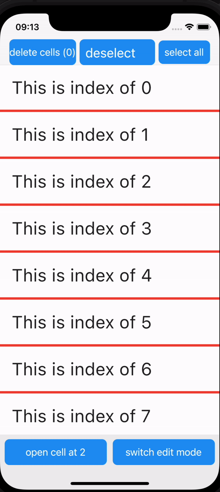

# flutter_swipe_action_cell_forked

A package that can give you a cell that can be swiped, effect is like iOS native

**Package forked from [flutter_swipe_action_cell](https://pub.dev/packages/flutter_swipe_action_cell)**

### If you like this package, you can give me a star😀. The more stars this project has, the more time I will speant in the project😀


### Donate:

- MOMO

 


## Get started

### 3.0.0 and later version is for flutter 3

##### pub home page click here: [pub](https://pub.dev/packages/flutter_swipe_action_cell_forked)

##### install:

```yaml
flutter_swipe_action_cell_forked: ^3.1.4
```  



Example:

```dart

class ItemView extends StatefulWidget {
  const ItemView({Key? key, this.item, this.controller}) : super(key: key);
  final Model? item;
  final SwipeActionController? controller;
  @override
  State<ItemView> createState() => _ItemViewState();
}

class _ItemViewState extends State<ItemView> with TickerProviderStateMixin {
  late Animation<double> animation;
  late AnimationController controller;

  @override
  void initState() {
    super.initState();
    controller = AnimationController(
      vsync: this,
      duration: Duration(milliseconds: 500),
      value: 0.0,
    );
    animation = Tween<double>(begin: 0, end: 1).animate(controller);
  }

  Future<void> onDoneAnimation() async {
    await controller.forward();
  }

  Future<void> onResetAnimation() async {
    controller.reverse();
  }

  @override
  Widget build(BuildContext context) {
    double width = MediaQuery.of(context).size.width;
    return Stack(
      children: [
        Container(
          width: width,
          height: 80,
          decoration: BoxDecoration(color: Colors.red),
          child: Row(
            children: [
              Expanded(child: Text('Texxt nay hienj ra khi sur dung cu chi')),
              Spacer(),
              Expanded(child: Text('Texxt nay hienj ra khi sur dung cu chi')),
            ],
          ),
        ),
        FadeTransition(
            opacity: animation,
            child: Container(
              width: width,
              color: Colors.white,
              child: GestureDetector(
                onTap: () {
                  Navigator.push(context, CupertinoPageRoute(builder: (ctx) => const HomePage()));
                },
                child: Padding(
                  padding: const EdgeInsets.all(20.0),
                  child: Text("This is index of ${widget.item?.index}", style: const TextStyle(fontSize: 30)),
                ),
              ),
            )),
        SwipeActionCell(
          controller: widget.controller,
          index: widget.item?.index,
          backgroundColor: Colors.transparent,
          key: ValueKey(widget.item),
          doneAnimation: onDoneAnimation,
          afterResetAnimation: onResetAnimation,
          trailingActions: [SwipeAction(onTap: (v) {}, performsFirstActionWithFullSwipe: true)],
          leadingActions: [SwipeAction(onTap: (v) {}, performsFirstActionWithFullSwipe: true)],
          child: Container(
            color: Colors.white,
            child: GestureDetector(
              onTap: () {
                Navigator.push(context, CupertinoPageRoute(builder: (ctx) => const HomePage()));
              },
              child: Padding(
                padding: const EdgeInsets.all(20.0),
                child: Text("This is index of ${widget.item?.index}", style: const TextStyle(fontSize: 30)),
              ),
            ),
          ),
        ),
      ],
    );
  }
}
```

```dart
class _SwipeActionPageState extends State<SwipeActionPage> {
  List<Model> list = List.generate(30, (index) {
    return Model()..index = index;
  });

  late SwipeActionController controller;

  @override
  void initState() {
    super.initState();
    controller = SwipeActionController(selectedIndexPathsChangeCallback: (changedIndexPaths, selected, currentCount) {
      print('cell at ${changedIndexPaths.toString()} is/are ${selected ? 'selected' : 'unselected'} ,current selected count is $currentCount');

      /// I just call setState() to update simply in this example.
      /// But the whole page will be rebuilt.
      /// So when you are developing,you'd better update a little piece
      /// of UI sub tree for best performance....

      setState(() {});
    });
  }

  Widget bottomBar() {
    return Container(
      color: Colors.grey[200],
      padding: EdgeInsets.only(bottom: MediaQuery.of(context).padding.bottom),
      child: Padding(
        padding: const EdgeInsets.all(8.0),
        child: Row(
          children: [
            Expanded(
              child: CupertinoButton.filled(
                  padding: const EdgeInsets.only(),
                  child: const Text('open cell at 2'),
                  onPressed: () {
                    controller.openCellAt(index: 2, trailing: true, animated: true);
                  }),
            ),
            const SizedBox(
              width: 10,
            ),
            Expanded(
              child: CupertinoButton.filled(
                  padding: const EdgeInsets.only(),
                  child: const Text('switch edit mode'),
                  onPressed: () {
                    controller.toggleEditingMode();
                  }),
            ),
          ],
        ),
      ),
    );
  }

  @override
  Widget build(BuildContext context) {
    return Scaffold(
      bottomNavigationBar: bottomBar(),
      appBar: CupertinoNavigationBar(
        middle: CupertinoButton.filled(
            padding: const EdgeInsets.symmetric(vertical: 10, horizontal: 10),
            minSize: 0,
            child: const Text('deselect all', style: TextStyle(fontSize: 22)),
            onPressed: () {
              controller.deselectAll();
            }),
        leading: CupertinoButton.filled(
            padding: const EdgeInsets.symmetric(horizontal: 0, vertical: 10),
            minSize: 0,
            child: Text('delete cells (${controller.getSelectedIndexPaths().length})', style: const TextStyle(color: Colors.white)),
            onPressed: () {
              /// 获取选取的索引集合
              List<int> selectedIndexes = controller.getSelectedIndexPaths();

              List<String> idList = [];
              for (var element in selectedIndexes) {
                idList.add(list[element].id);
              }

              /// 遍历id集合，并且在原来的list中删除这些id所对应的数据
              for (var itemId in idList) {
                list.removeWhere((element) {
                  return element.id == itemId;
                });
              }

              /// 更新内部数据，这句话一定要写哦
              controller.deleteCellAt(indexPaths: selectedIndexes);
              setState(() {});
            }),
        trailing: CupertinoButton.filled(
            minSize: 0,
            padding: const EdgeInsets.all(10),
            child: const Text('select all'),
            onPressed: () {
              controller.selectAll(dataLength: list.length);
            }),
      ),
      body: ListView.builder(
        physics: const BouncingScrollPhysics(),
        itemCount: list.length,
        itemBuilder: (context, index) {
          return _item(context, index);
        },
      ),
    );
  }

  Widget _item(BuildContext ctx, int index) {
    return ItemView(item: list[index],controller: controller,);
  }
}
```
